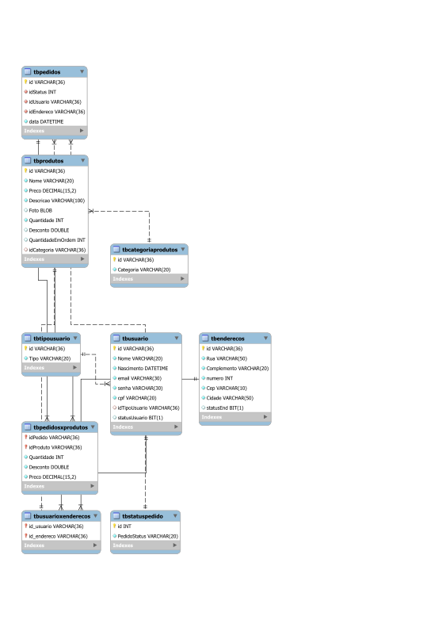
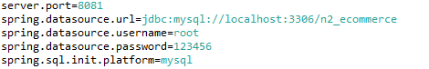

# N2_ECOMMERCE
Projeto da disciplina de Linguagem de Programação III
O objetivo é criar API's de um CRUD, nosso CRUD se baseia em uma aplicação de ecommerce.

Os integrantes do grupo são:

Rodrigo Emiliano de Oliveira - RA:081190004

Gabriel Alves Gouveia -        RA:081190038

Yago José Barros Caetano     - RA:081190027

Lucas Santos Costa           - RA:081190015

## Tecnologias
-Spring-boot
-Java 17
-Postman
-MySQL

## Diagrama do Banco de dados

## Instruções de Uso:
1- Crie o banco de dados conforme o script de banco disponivel em:
[Script do Banco de dados](my_sql/Query%20CriarBanco.sql)

2-Insira suas credenciais do banco, usuario, senha e a url do Mysql no arquivo: 
[application.properties](src/main/resources/application.properties)
Exemplo:

## Documentação da API
A documentação da API foi realizada com o Postman, a collection foi disponibilizada no repositório:
[Postman collection](doc/N2_ECOMMERCE.postman_collection.json)

